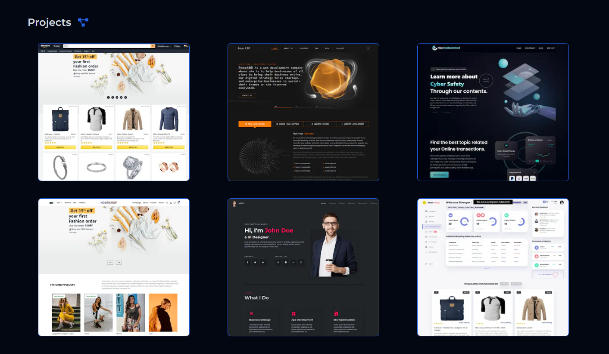
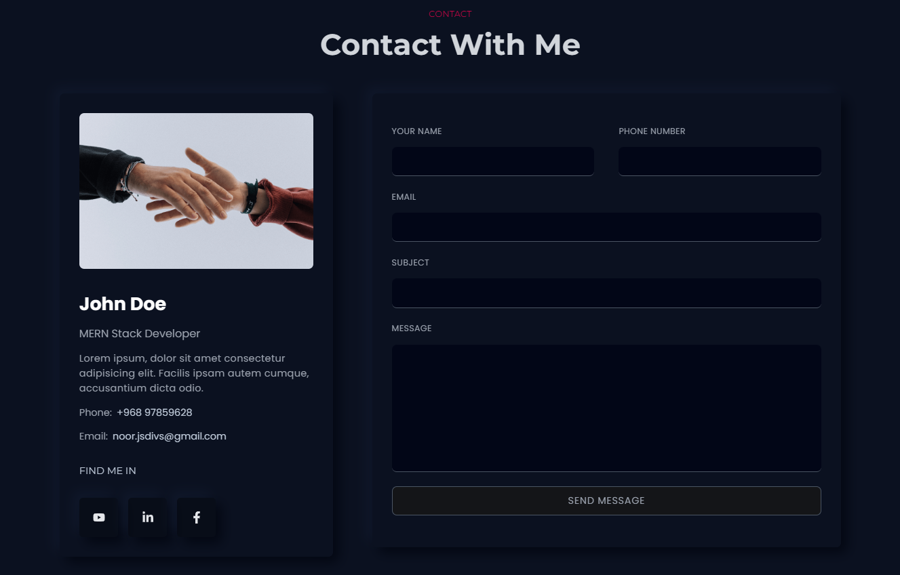

<h2> 🌱 Project Section </h2>

##### 🔗 [( Demo Link )](https://portfoliofouryt.vercel.app/) [( GitHub Link )](https://github.com/noorjsdivs/portfoliofouryt)

<h2> 🌱 Templete Portfolio (ReactJS + TypeScript) </h2>

##### 🔗 [( Demo Link )](https://free-portfolio-one.vercel.app/) [( GitHub Link )](https://github.com/noorjsdivs/free-portfolio-one)

<h2> 🌱 Photo Corner </h2>

##### 🔗 [( Demo Link )](https://www.youtube.com/watch?v=OtqxDT0IlHI) [( GitHub Link )](https://github.com/emetdas/Youtube-code/tree/master/web%20components/React-Swiper-Slider-3D-Coverflow)

<h2> 🌱 Gallery Showcase </h2>

##### 🔗 [( Demo Link )](https://orebishopping.vercel.app/) [( GitHub Link )](https://github.com/noorjsdivs/orebishopping)

