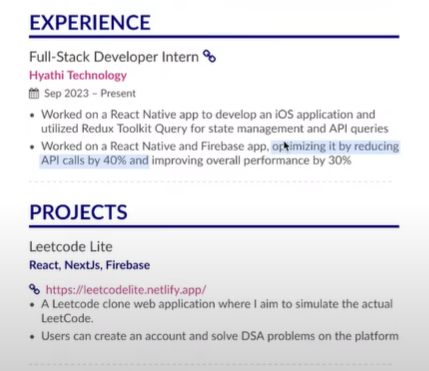
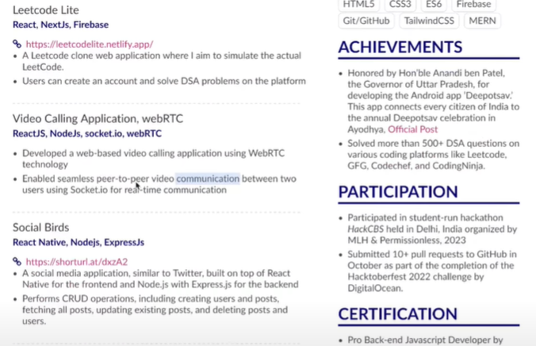
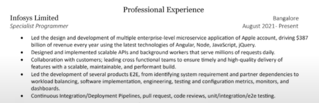
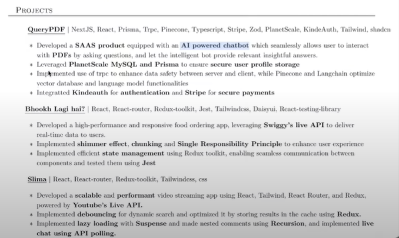

## 🙄🗝️ Curriculum Vitae 🗝️🙄

#### 🌱 ( My CV [ : 👉 Click Here](./Sumonta_CV.pdf) )

##### ( [😾 My Portfolio](https://sumonta-portfolio.vercel.app/l) )

## 😾 Portfolio Idea's [ : 👉 Click Here](./Portfolio/Readme.md)

## 🎉 Latex Resume Template [ : 👉 Click Here](https://github.com/subidit/rover-resume)

## 🌱 CV Writing Tips

- No Need Summary and Objectives
- Must be 1 Page
- Font Size Matters
- Most important thing and first thing to be notices should be your projects
- Project >> Skills (Showcase skills in projects rather than another section on skills section)
- Top Priority : Project - Achivements
- Add : Github and Live Demo Link in Projects.
- Write Project points in bullet points
- Write the challenging points of your project
- LinkedIn Link - GitHub Link Must
- No need to write Hobby and Interests

<h2> 🌱 Example of A Quality CV : Experience, Projects</h2>

## 🌱 Resource

#### 💫 Latex CV Templates : ([👉 Click Here ](https://www.overleaf.com/gallery/tagged/cv/page/1)) 

#### 💫 Template - 1 : ([👉 Click Here ](https://www.latextemplates.com/template/freeman-cv)) ([👉 Overleaf Link ](https://www.overleaf.com/project/6588fc1c96a768adfde56b19))

#### 🐛 Template - 2 : ([👉 Click Here ](https://www.latextemplates.com/template/awesome-resume-cv)) ([👉 Overleaf Link ](https://www.overleaf.com/project/6588fc23d7e2495b88719ea5))

#### 🐛 Template - 3 : ([👉 Click Here ](https://www.latextemplates.com/template/deedy-resume-cv)) ([👉 Overleaf Link ](https://www.overleaf.com/project/6588fba6d7e2495b88718fd6)) ([👉 Portfolio Link ](https://debarghyadas.com/))

| Name                  |          Company Name           |                                              Links |
| :-------------------- | :-----------------------------: | -------------------------------------------------: |
| Debarghya Das         |             Google              | [👉 Click Here](./Others/debarghya-das-resume.pdf) |
| Zhalok Rahman         |            InnovexIT            |    [👉 Click Here](./Others/Zolok%20Bhai%20CV.pdf) |
| TAMER SHAHEEN         |   Mechanical Design Engineer    |           [👉 Click Here](/Others/Tamer%20Vai.pdf) |
| Souhardya Saha        |          Kaaz Software          | [👉 Click Here](./Others/Souhardya%20Vai%20CV.pdf) |
| Shakirul Hasan Khan   |          Kaaz Software          |  [👉 Click Here](./Others/Shakirul%20Vai%20CV.pdf) |
| Mehedi Hasan Shifat   | Dynamic Solution innovators Ltd |     [👉 Click Here](./Others/Sifat%20Vai%20CV.pdf) |
| MAHFUZUR RAHMAN EMON  | Dynamic Solution innovators Ltd |      [👉 Click Here](./Others/Emon%20Vai%20CV.pdf) |
| Md Fahim              | Dynamic Solution innovators Ltd |    [👉 Click Here](./Others/Fahim%20Bhai%20Cv.pdf) |
| Partha Protim Paul    |             Orbitax             |       [👉 Click Here](./Others/PPP%20Sir%20CV.pdf) |
| JAGONMOY DEY          |    Cefalo Bangladesh Limited    |     [👉 Click Here](./Others/joga%20bhai%20CV.pdf) |
| SHAHRIAR ELAHI DHRUVO |           Bengali AI            |   [👉 Click Here](./Others/Dhurobo%20VAi%20CV.pdf) |

